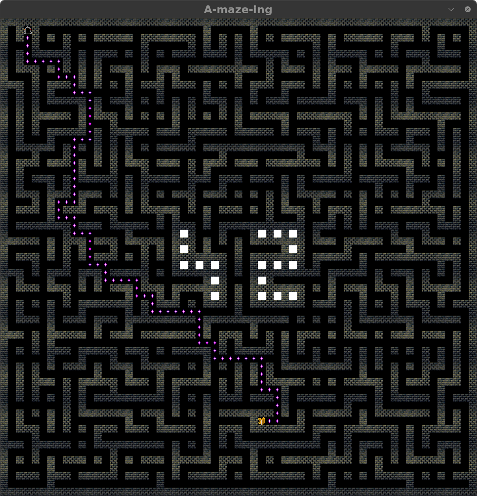

*This project has been created as part of the 42 curriculum by odschreu, lelouren*

# a_maze_ing



## Description

a_maze_ing is a maze generator project for the 42 core curriculum. It is a python written program that allows you to generate a maze and its shortest path solution. The maze is visualized with the MiniLibX library. The maze generator will allow you to set entry and exit points, as well as whether you would like a perfect or imperfect maze generated. You can also regenerate or reproduce the same maze by the use of a seed.

## Goals of this project

[ ] Create a maze generator from a config file  
[ ] Generate a perfect maze  
[ ] Output the maze as a hexadecimal representation  
[ ] Create a visual representation of the maze and its shortest path solution  
[ ] Ensure it is appropriately packaged for reusing later  

# Instructions

# Resources

## Using Git for team work

1. <https://devot.team/blog/git-collaboration>
2. <https://github.com/hei1sme/git-github-book>
3. <https://dev.to/gladyspascual/a-beginner-s-guide-to-using-git-when-working-with-a-team-for-the-first-time-1hba>

## Makefiles

1. <https://earthly.dev/blog/python-makefile/>

## Maze generation

1. <https://www.youtube.com/watch?v=184Oair5iys>
2. <https://en.wikipedia.org/wiki/Maze_generation_algorithm>
3. <https://stackoverflow.com/questions/38502/whats-a-good-algorithm-to-generate-a-maze>
4. <https://professor-l.github.io/mazes/>
5. <https://dchakarov.com/blog/maze-algorithms/>
6. <https://uca.hal.science/hal-03174952v1/document>

# Additional Information

## Structure and format of the config file

```
WIDTH=20
HEIGHT=25
ENTRY=0,0
EXIT=19,14
OUTPUT_FILE=maze.txt
PERFECT=True
#SEED=42
```

## Maze generation Algorithm

### Why we chose it

## Reusable code

## Team and project management

### Team members

1. odschreu
2. lelouren

### Project planning

### What worked well

### What can be improved

### Tools

- `pytest` — unit testing
- `mypy` — static type checking
- `flake8` — code style linting
- `make` — task automation
- `pip` — package management
- `venv` — virtual environment isolation
- `build` / `setuptools` — packaging the maze generator
- `minilibx-linux` — graphical display (C library loaded via ctypes)
- `Claude` — concept explanation, debugging, project planning

#### AI usage

Claude:

- Breaking down project requirements into daily tasks
- Explaining concepts such as ctypes and algorithms
- Formatting
